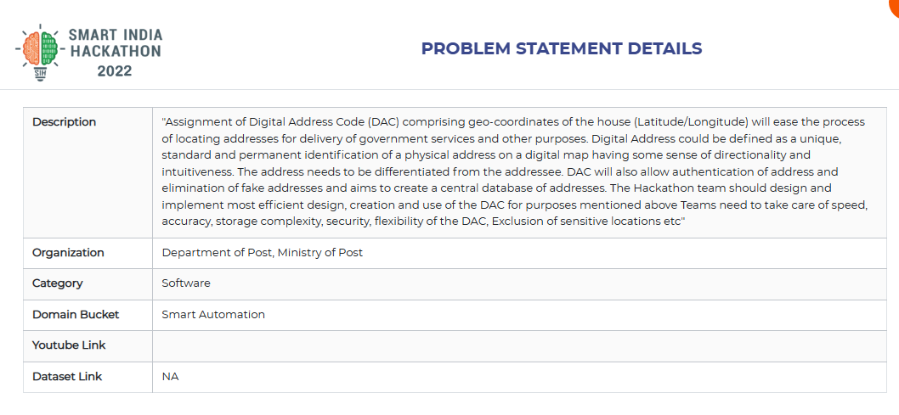

# Digital-Access-Code-Generation
# Introduction
<b>Assignment of Digital Address Code (DAC) comprising geo-coordinates of the house (Latitude/Longitude) will ease the process of locating addresses for delivery of government services and other purposes. Digital Address could be defined as a unique, standard and permanent identification of a physical address on a digital map having some sense of directionality and intuitiveness. The address needs to be differentiated from the addressee. DAC will also allow authentication of address and elimination of fake addresses and aims to create a central database of addresses. The Hackathon team should design and implement most efficient design, creation and use of the DAC for purposes mentioned above Teams need to take care of speed, accuracy, storage complexity, security, flexibility of the DAC, Exclusion of sensitive locations etc<b>

# Problem Statement

 

# Our Team 
<ul>
<li><h2>Jayaprakash M   - CSE'24 Team Lead</h2></li>
<li><h2>Sanjay Kumar M  - EEE'24 Team Member</h2></li>
<li><h2>Krishna Kumar M - CSE'24 Team Member</h2></li>
<li><h2>Gayathri R      - EEE'24 Team Member</h2></li>
<li><h2>Prabhu S        - CSE'24 Team Member</h2></li>
<li><h2>Anitha K        - EEE'24 Team Member</h2></li>
<li><h2>Arumugam        - CSE Faculty Team Mentor</h2></li>
</ul>

# Description Idea

In today's digital world, problems and solutions are becoming increasingly digitalized. We came across an interesting problem in this queue; it was such a problem that it had minimal direct influence on people; in fact, people did not even recognize it to be a problem. However, it is the first problem in society to be addressed. People do not consider this a problem because it appears to be a properly operating system. But it isn't; fixing this issue would grant us the gift of time, which we could use to address a slew of other issues that plague us. At some point in our lives, we may have changed our home or working environment. However, after the move, we have the task of updating them in all of the official documents that we have on hand. It's a big process to update each document every time. because an address is something that changes throughout time. However, dynamic things are discouraged in printed documents. Even if want to invite a stranger to home, we need to instruct them each time to reach out our house with the help of landmarks, which are neither less dynamic than address. Even if want to invite a stranger to home, we need to instruct them each time to reach out our house with the help of landmarks, which are neither less dynamic than address. At least not to invite, if we ordered a new product or food via online store, even then we have to describe how to reach our address, some time he/she ends up in the place with the same street name of ours. Aren't we bored to describe our addresses? What if we can tell them some random 7 or 9 digit code once, with out another phone call they would be on your door step. As per the problem statement given by the Department of post, Ministry of Post, we are here to address a new addressing system that gives one stop solution to all the above mentioned problems. 

PROBLEM DESCRIPTION: Here we have a new digital addressing system, similar to how each connected item has its own MAC address and IP address, which allows us to identify them uniquely. We call it Digital Access Code / Digital Address Code. What is Digital Address Code? + It is being created by the Department of Posts, Government of India. Under this arrangement, each house will have its own separate code 
+ Digital address code are a unique numeric or alphanumeric representation of the geospatial coordinates 
+ Every address in the country will be identified to create a Digital Address Code. After identifying the address, it will be linked to the geospatial coordinates. 
+ This will be a unique code like the number of the Aadhaar card, which will be given to every citizen of India according to their address 
+ To find a method to identify certain place on this blue planet, whatever we do, we always come back to latitudes and longitudes because they are the most unchanging way to describe each spot on the planet.
+ However, remembering two sets of eight or nine digits each time is quite difficult. As a result, we'll utilize an encoded format such as plus code to represent the address in a considerably more compact way. 
+ Assume that DAC is a function that takes 2 inputs and give some output as far now. 
+ DAC(latitude, longitude)=>Magical 7 or 9 digit Alpha Numeric Code. 
+ Process Flow 1 - Generation of DAC: 
+ Assume a 20 square of equal grids that pass through our country, within each of those 20 grids, another 20 grids are subscripted, It goes on forever. Now each of the row and column contains some Alphabet or Numeric Values from 0 to 9 and from A to K. On every gird, each row intersect each columns, those cells are named correspondingly like Regular Expression:{row}{column} by doing this we would end up at 3x3 square meters represented by one cell with around 8 digits along with the name of city.
+ Process Flow 2- Assignment of DAC to houses automatically 
+ After the generation process, we are going to analyse over the satellite map images and use AI/ML algorithms to distinguish the houses, each of the identified houses will be auto assigned with the corresponding DAC its value will be registered in the cloud. We are going to use the Edge Detection technology to perform this automation.
+ Process Flow 3 - WebApp: 
+ In this process, we are going to develop a website which is handy and user friendly, in which the citizens can update their address in the form of DAC in their comfort place with some submission of the address proof. which will be auto analysed by an bot that keeps track of the dictionary of original address and its corresponding DAC. 
 

# Unique  Features of DAC:
 * Minimal Digits 
 * Works Offline
 * Directly Integrated 
 * Free of dynamic data 
 # Applications of DAC: 
 +  Online Authentication 
 +  Quality Delivery Service 
 +  Permanent Code 
 +  One Nation One Address 
 +  Truly Digital eKYC 
 +  No Fake Address 
# Special Features: 
 + Integrated with G-Map => Speed 
 + Continuous Grids => Directionality 
 + Hides Sensitive areas=> Security 
 + Easily Changeable => Flexibility 
 + No Dynamic Like H.no., Street Name=> Zero Dynamicity 
 + 6 digits for 3*3 square meters => Accuracy 
 + Dedicated WebApp => Easily Accessible 
 + Auto Assignment of DAC => Automation

# Screenshots of Final Product
Login Screen

